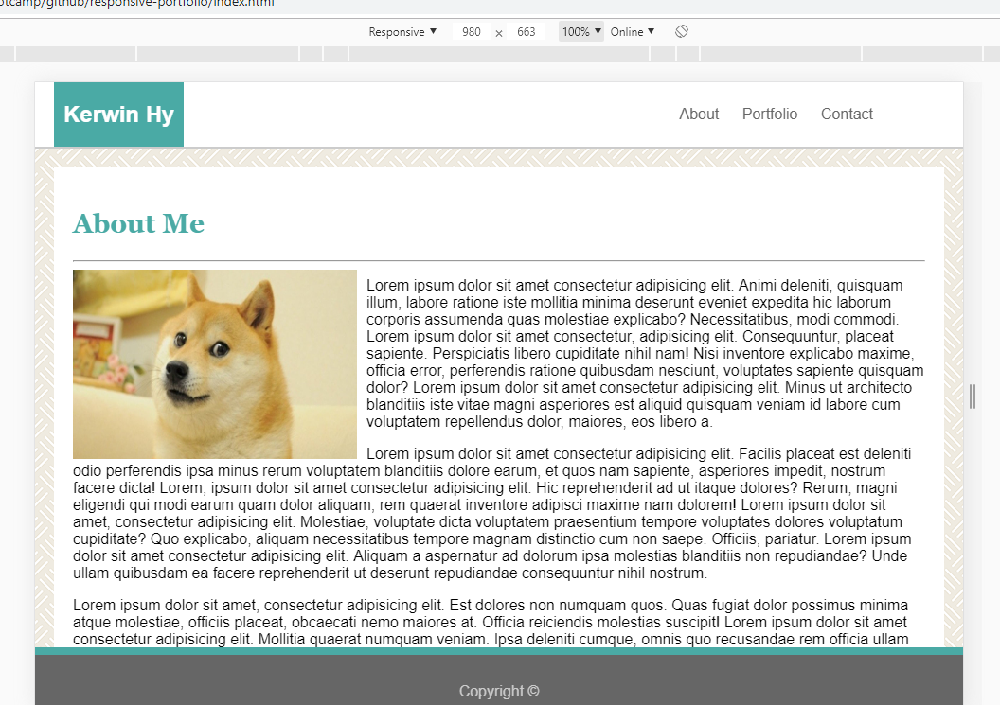
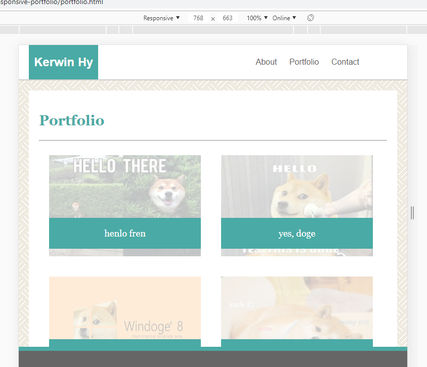
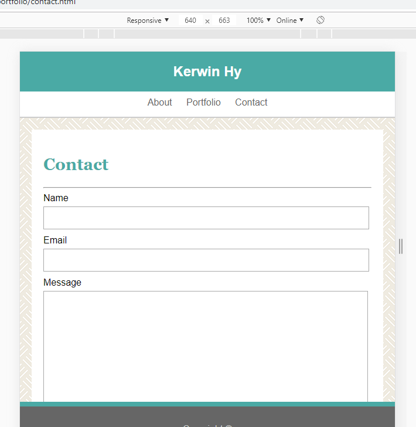

# responsive-portfolio


## Site Picture






## Technologies Used
- HTML
- CSS
- Git
- GitHub
- VSCode

## Summary
Redesign ~/seiretsym/basic-portfolio using to be responsive using @media tags and adjusting widths/margins to 100%/auto/etc.

## Links
Live Page: [https://seiretsym.github.io/responsive-portfolio](https://seiretsym.github.io/responsive-portfolio)<br>
Repo: [https://github.com/seiretsym/responsive-portfolio](https://github.com/seiretsym/responsive-portfolio)<br>
LinkedIn: [https://www.linkedin.com/in/kerwinhy/](https://www.linkedin.com/in/kerwinhy/)<br>
GitHub: [https://github.com/seiretsym](https://github.com/seiretsym)<br>

## Code Snippet
```
@media only screen and (max-width: 980px) {
    .container {
        max-width: 90git statu0px;
        margin: 0px 60px 0px 20px;
    }

    .container-header {
        max-width: 960px;
        margin: 0px 60px 0px 20px;
    }
}

@media only screen and (max-width: 768px) {
    .container {
        max-width: 708px;
        margin: 0px 60px 0px 20px;
    }

    .container-header {
        max-width: 768px;
        margin: 0px 60px 0px 20px;
    }
}

@media only screen and (max-width: 640px) {
    .container {
        max-width: 580px;
        margin: 0px 60px 0px 20px;
    }

    .container-header {
        max-width: 640px;
        margin: 0px;
        padding: 0px;
    }

    .photo {
        float: none;
        width: 100%;
        height: 100%;
    }
```